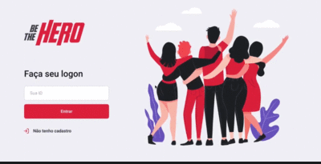

<h1 align="center" style="border-bottom: 1px solid #eee; margin: 20px 0; padding-bottom: 10px;">
<br>
<p>Seja um herói! 🦸‍♂️</p>
</h1>


<p align="center" >
  <a href="#fire-prévia-da-aplicação"> :fire: Prévia da Aplicação</a> |
  <a href="#rocket-tecnologias-utilizadas"> :rocket: Tecnologias Utilizadas</a> |
  <a href="#zap-executando-o-projeto"> :zap: Executando o Projeto </a> |
</p>

## :bookmark_tabs: Sobre o Projeto

O projeto ***Be The Hero*** é uma aplicação onde ONGs podem se inscrever e adicionar casos para que algum herói de plantão possa salvar o dia ao contribuir com esse caso. Foi desenvolvida durante a Semana OmniStack 11 da [Rocketseat](https://rocketseat.com.br/).

## :fire: Prévia da Aplicação

<div align="center">



</div>

## :rocket: Tecnologias Utilizadas


- [NodeJS](https://nodejs.org/en/)
- [ReactJS](https://pt-br.reactjs.org/)
- [ReactNative](https://reactnative.dev/)
- [ExpressJS](https://expressjs.com/pt-br/)
- [Knex](http://knexjs.org/)
- [Axios](https://github.com/axios/axios)

## :zap: Executando o Projeto


#### Clonando o projeto

```jsx
$ git clone https://github.com/alancsoliveira/rocketseat-Be-The-Hero.git
$ cd rocketseat-Be-The-Hero
```

#### Iniciando o backend

```jsx
$ cd backend
$ yarn && yarn start
```

#### Iniciando o Frontend

```jsx
$ cd frontend
$ yarn && yarn start
```

#### Iniciando o Mobile(Android)

```jsx
$ cd mobile
$ yarn && yarn start
```

## :memo: Licença

Este projeto foi desenvolvido sob a licença MIT. Veja o arquivo [LICENSE](LICENSE) para saber mais detalhes.


<p align="center" style="margin-top: 20px;">
  
</p>

<p align="center" style="margin-top: 20px;">Made with :purple_heart: by <strong> Alan C S Oliveira </p>
